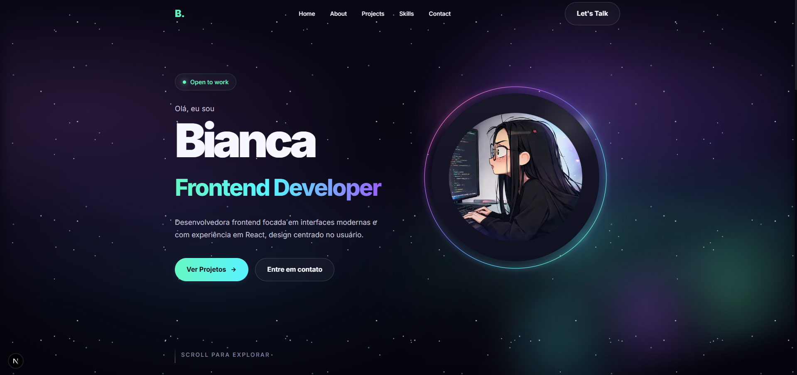

# Bianca Bezerra — Personal Portfolio

[](https://nextjs.org/)
[](https://react.dev/)
[](https://www.typescriptlang.org/)
[](https://github.com/css-modules/css-modules)
[](https://www.biabez.dev/)

Personal portfolio developed to showcase my professional profile, selected projects, technical stack, and contact channels through a modern, responsive, and visually consistent experience.

This project was built with a focus on **performance**, **component-based architecture**, **maintainability**, and **clean UI structure**, reflecting my approach to frontend development with modern React ecosystem technologies.

---

## Live Demo

[Access the live project](https://www.biabez.dev/)

---

## Preview

[](https://www.biabez.dev/)

---

## About the Project

This application works as my professional portfolio on the web, bringing together in one place:

- personal introduction
- featured projects
- technical skills and stack
- professional contact channels

Beyond its institutional purpose, this project also represents a practical application of key frontend concepts such as:

- reusable component architecture
- application structuring with Next.js App Router
- separation of concerns
- modular styling
- responsive interface development

---

## Main Features

- responsive layout
- modern hero section
- about section
- featured projects showcase
- stack/skills section
- contact section with professional links
- reusable component structure
- scalable organization for future improvements

---

## Tech Stack

- Next.js 16
- React 19
- TypeScript
- CSS Modules
- React Icons

---

## Project Structure

```bash
src/
  app/
    about/
    contact/
    projects/
    favicon.ico
    globals.css
    layout.tsx
    page.module.css
    page.tsx

  components/
    AboutPreview.module.css
    AboutPreview.tsx
    ContactSection.module.css
    ContactSection.tsx
    Footer.module.css
    Footer.tsx
    Hero.module.css
    Hero.tsx
    Navbar.module.css
    Navbar.tsx
    ProjectCard.module.css
    ProjectCard.tsx
    ProjectsSection.module.css
    ProjectsSection.tsx
    SkillsPreview.module.css
    SkillsPreview.tsx

  lib/
  types/
```

---

## Featured Projects

### Personal Portfolio

A personal portfolio built with **Next.js**, **React**, and **TypeScript**, focused on responsiveness, visual identity, and component organization.

### Technology Organizer

A React-based application created to organize technologies by priority, integrated with **Supabase**.

### AniVerse Landing Page

A landing page inspired by anime/streaming platforms, built with **HTML**, **CSS**, and **JavaScript**, with emphasis on layout structure and responsive design.

---

## Skills Highlighted in the Portfolio

- HTML5
- CSS3
- JavaScript
- TypeScript
- React
- Next.js
- Node.js
- Git
- GitHub
- SQL / MySQL
- Supabase

---

## Running Locally

### 1. Clone the repository

```bash
git clone https://github.com/bia-bez/bia-bez-portfolio.git
```

### 2. Enter the project folder

```bash
cd bia-bez-portfolio
```

### 3. Install dependencies

```bash
npm install
```

### 4. Start the development server

```bash
npm run dev
```

### 5. Open in your browser

```bash
http://localhost:3000
```

---

## Production Build

To generate the optimized production build:

```bash
npm run build
```

To start the application in production mode:

```bash
npm start
```

---

## Available Scripts

```bash
npm run dev
npm run build
npm start
npm run lint
```

### Script Description

- **npm run dev** — starts the application in development mode
- **npm run build** — generates the production build
- **npm start** — runs the production build
- **npm run lint** — runs code linting

---

## Project Goal

The goal of this project is to consolidate my professional presence in a dedicated application, demonstrating my ability to design and build modern, organized, and responsive frontend interfaces.

More than a presentation page, this portfolio reflects how I think about structure, user experience, and visual consistency in frontend development.

---

## Future Improvements

Some possible next steps for the project:

- CMS integration
- internationalization
- project category filters
- dedicated case study pages
- functional contact form with backend/server actions
- more advanced animations
- dark mode with persisted preference

---

## Contact

- **Portfolio:** [biabez.dev](https://www.biabez.dev/)
- **GitHub:** [bia-bez](https://github.com/bia-bez)
- **LinkedIn:** [bia-bez](https://www.linkedin.com/in/bia-bez)

---

## License

This project was developed for professional portfolio purposes.